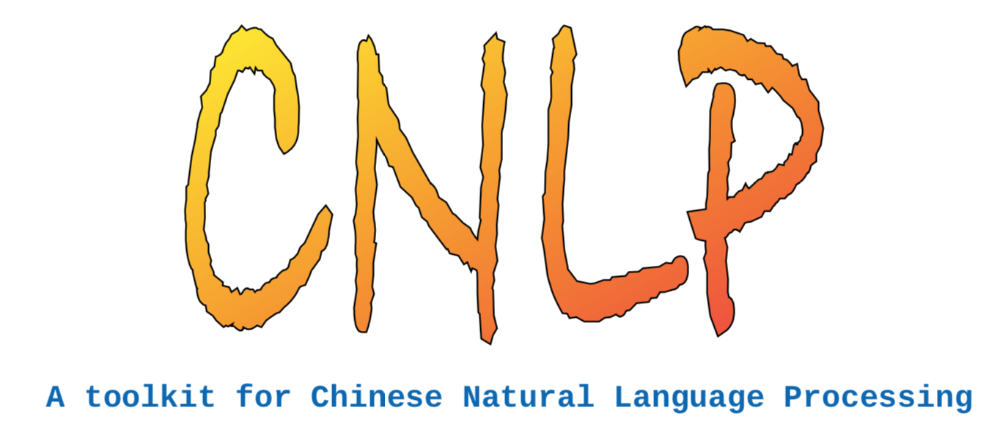
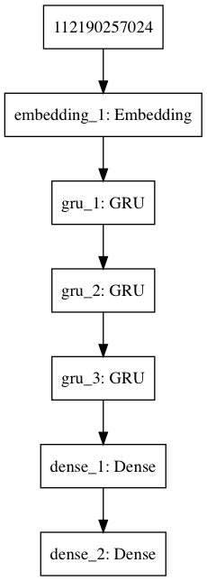
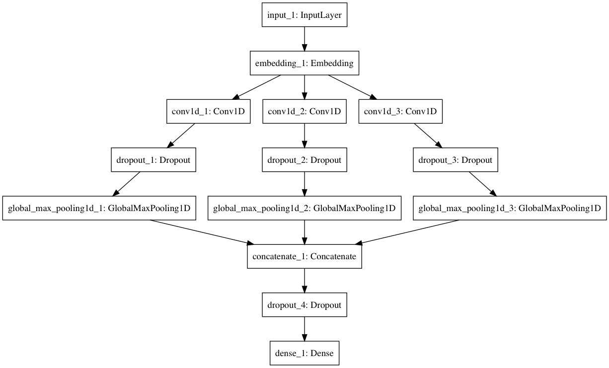
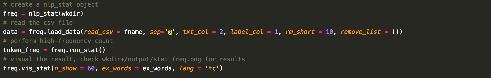
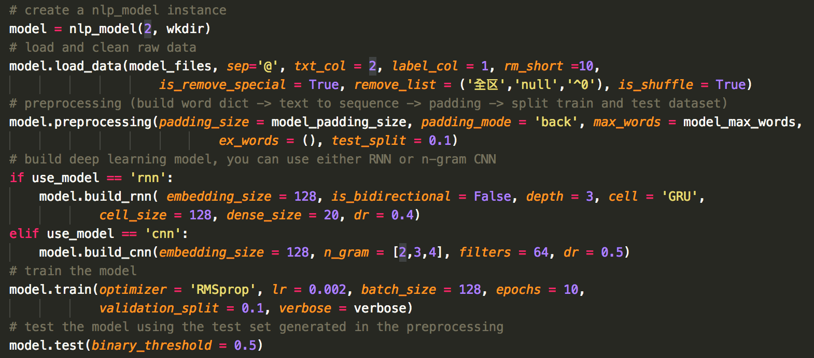
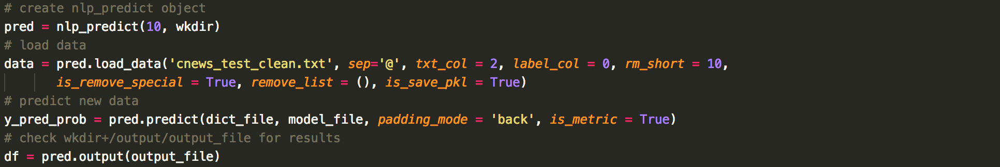

  

# 歡迎來到Project CNLP

CNLP是一個基於Python以及深度學習來完成文本分類以及情緒預測的中文自然語言處理包（同時支援繁體與簡體）。 它能夠幫助使用者使用快速的完成高頻詞統計，建構深度學習模型，以及預測未知數據。這個工具包總共含有三個主要的模組：  

* 高頻詞統計(NLP_Stat)：這個模組可以幫助使用者快速的載入數據，清洗文本資料，中文分詞，高頻詞統計，並將高頻詞以圖表方式呈現，幫助使用者快速的對文本數據的特性有個大致的了解。

* 建構深度學習模型(NLP_Model)：這個模組能夠幫助使用者快速進行大量的文本數據預處理，將中文文本轉換成相應的數值向量。此模組還能夠幫助使用者快速的建構一個典型的深度學習RNN，包括單向以及雙向的RNN，並支援多種RNN cell，包括Simple RNN, GRU,以及 LSTM。在模型建構完成後亦可輕易地調用多種優化器(SGD, PRMprop, Adam)進行模型訓練以及測試。

* 未知數據預測(NLP_Pred): 這個模組能夠幫助使用者快速的調用已經訓練好的深度學習模型，並使用該模型對未知的數據進行數據清洗以及結果預測。

# 背景介紹
文本分類以及情緒分析是自然語言處理以及深度學習中常見的問題。目前已經有多種針對英文文本數據的自然語言處理工具包，但是對於中文的工具包仍然十分缺乏。因此建構了這個簡單的工具包來快速的搭建深度學習模型做文本數據分析。本工具包的目的並不在提供強大的擴展性，而是希望在不失基本的彈性的情況下，讓使用者盡可能使用少量的命令來處理大多數的文本分類問題。    

中文數據和英文數據很大的不同在於切詞(tokenize)，因為英文裡面，每個單字會以一個空格做區隔，但是在中文裡面，中文詞彙之間並沒有類似的區隔符，這導致了要把中文詞彙做出正確的分割十分困難。為了解決這個問題，在CNLP中我們使用了jieba作為中文切詞引擎 (https://github.com/fxsjy/jieba) ,jieba是一個相當優秀的python中文切詞工具，除了能自動切詞之外，使用者也可依據自己的需求來增加或刪除詞彙，並調整詞頻高低。在CNLP中，你能夠使用簡單的函數就調用jieba處理大多數的中文文本場景。

在深度學習方面，CNLP能夠對文本數據進行預處理，將文本數據轉換成訓練所需的向量形式，並使用了Keras以及Tensorflow來進行深度學習。裡面已經預先架構好了一個能適用大多數場景的深度學習RNN模型，使用者能夠依據自己的需求來調整模型相關的參數。在訓練完畢之後，CNLP亦可調用已經訓練好的深度學習模型來對未知的數據進行預測。

由於中文自然語言處理的數據極其缺乏，在CNLP裡面也整理了兩個數據集供使用者測試。第一個數據集是來自攜程網的酒店評論數據，這個數據量偏少，正負評各約一千則（如果有更大的中文情緒分析數據集也請來信告知，讓我加入其中），作為深度學習之用太小了，但主要是供大家測試之用。第二個數據集是來自北京清華大學的THUCNews，這個數據集包含十四個類別，超過七十萬則新聞，整個數據超過1.5G，太大了，不適合做為測試之用，因此我們採用了網路上提供的另一個簡化版本 (https://github.com/gaussic/text-classification-cnn-rnn) ,在這個簡化版本中，共有十個類別，50000條訓練數據，5000條驗證數據，以及10000條測試數據。以上兩個數據集已經完成了基本的數據清洗，並且上好了相應的標籤。使用者可以在程式裡面直接使用不用再做任何處理。此外為了滿足不同中文使用者的需求，兩個數據集都提供了簡體以及繁體中文的版本。

考量到使用者可能會有自己的需求，因此CNLP的設計是，每一步執行完後都會將結果儲存成pickle檔，以供日後調用(亦可以參數方式輸出)。因此除了使用CNLP來進行完整的分析外，亦可使用CNLP來進行部分的預處理，搭配自己的程式使用，增加了CNLP的彈性。

# 深度學習模型
為了方便使用者快速建立深度學習模型，在CNLP中提供了兩種典型的文本分類模型，分別是RNN以及n-gram CNN。

## RNN
使用RNN處理NLP是一種相當自然的做法，每個詞向量先被表示成孤熱編碼形式（one-hot)，而後被送入word embedding層進行壓縮。在這裡我們並沒有使用任何Pretrained word embedding，所有的embedding參數都是透過數據本身訓練得出的。而後這些被壓縮過後的詞坎入向量會送往一個深度RNN層（深度由使用者定義），而RNN層輸出的向量會再送往一個dense layer最後送到機率輸出層，模型的示意圖表示如下：（見英文版部分附圖）

在本模型中，使用者需要定義的是embedding層的大小(i.e. 輸入向量要被壓縮的維度)，RNN層要使用何種cell(Simple RNN, LSTM, GRU)，每個cell中neuron的數目，RNN層的深度(本圖中，深度為3)，以及最後用來執行fine tuning的dense layer的大小。圖中最後一層dense layer是機率輸出層，所以大小和分類的類別數相同，因此使用者無需自訂。另外每個RNN cell中都採用了dropout，所以使用者亦需給定dropout rate。

一般來說，深度RNN計算量較大，且較不易訓練，也較容易產生性能飽和，但是如果文本的特性具有相當的長程關聯性(i.e. 文本前後間的關聯性高，難以靠識別幾個關鍵字就抓出主題)，則使用RNN是必要的。不過在一般的情況下，我們建議使用者優先考慮n-gram CNN。

## n-gram CNN
n-gram CNN是最年來開始興起的NLP文本分類方法，最早是2014年由NYU的[Yoon Kim (arXiv:1408.5882)](https://arxiv.org/abs/1408.5882) 所提出，該論文提出後立刻引起了廣泛的注意，在短短三年間就累積了超過兩千次的引用率，其後有諸多改良版本被提出，在這CNLP中我們採用的是由UT Austin的 [Y. Zhang & B. Wallace (arXiv:1510.03820)](https://arxiv.org/abs/1510.03820)所提出的架構，該架構可表示如下：(見英文版部分附圖)

在本模型中，使用者需要給定的參數包括要使用哪些n-gram，n-gram給定的越多，上圖中的卷積層分支就會越多，（一般建議可從n_gram = [2,3,4])開始嘗試，則會如上圖共有三個分支，分別執行n=2,3,4的卷積)，最後送到global max pooling層（使用global max pooling而不用一般的max pooling是近年來叫流行的做法，諸多實驗表明這可以減少overfitting，提升計算性能，同時又不影響模型表現，這也是Z&W的論文中所建議採取的方法。因此CNLP中我們也採用此法，減少輸入參數與使用者的困擾)，而後經由一個dropout送到輸出層。同樣的，該輸出dense層的大小必須等同於分類的類別數，因此無需使用者自訂大小。

從上面的討論可以發現，n-gram CNN所需要給定的參數相當少，另外計算速度也相當快，在許多測試中的表現亦優於RNN，因此一般的情況下，我們建議使用者優先嘗試n-gram CNN。

# Welcome to Project CNLP
 CNLP is a python-based deep learning natural language processing toolkit for Chinese text classification and sentiment analysis (both Traditional and Simplified Chinese). It helps users finish a job such as analysis of high-frequency words, building deep learning models, and prediction of unlabeled data with only few commands (usually 3~5 lines). CNLP consists of three pars:   

 * count high-frequency words (NLP_stat): this module helps users quick load, clean and tokenize your Chinese text data. Then perform word counting on the whole dataset and output a word frequency plot. Users can have a simple and quick impression of the data. 
 
 * build deep learning models: this module helps user preprocess (tokenize, convert to word vectors, split to training and test dataset) the text data, build deep learning RNN models and evaulate the model. CNLP has a pre-designed RNN framework that should be compatiable with most scenarios. Users can still fine-tuned several hyper-parameters such as depth of the RNN, cell of the RNN (Simple RNN, LSTM, GRU), direction of the RNN (unidirectional, bidirectional). Once the model has been built, CNLP can train the model using various optimizers (e.g., SGD, RPMprop, Adam) and evaulate its performance automatically. 
 
 * prediction of unlabeled data: This module helps users to quickly analyze unlabeled data using the pretrained model. 

 # Background
 Text classification and sentiment analysis are very common problems in the field of Natural Language Processing and deep learning. There are already tons of libraries that helps users quickly do the jobs. However, such library for Chinese NLP remains lacking. Filling the gap for the Chinese user community is the purpose of this project. This project doesn't intend to provide a highly flexible library for general purpose. Instead, this project aims to help users use as less commands as possible to do text classification and sentiment analysis without losing minimal flexiblity.

 A huge difference between English and Chinese text data is "tokenization". In English, each word is separated by a space, so tokenize a English text is straightforward. However, there is no such structure in Chinese. Therefore, how to correctly tokenize a Chinese text become a difficult issue. To this end, we introduce jieba (https://github.com/fxsjy/jieba) as our tokenization engine. This is an excellent open-source tokenization tool with flexible features such as add words, delete words, change word frequency, etc. In CNLP, you can control jieba thruogh a few inputs to deal with most Chinese texts. 

 As for deep learning, CNLP can help usrs quickly preprocess the data and use Keras and Tensorflow as backends to perform deep learning calculations. Users can build and train the model with a fews inputs.

 Due to the lack of Chinese text dataset, CNLP prepered two dataset for users to test. The Hotel review dataset is from Ctrip. It contains about 1000 positive comments and 1000 negative comments. This is certainly too small for a deep learning model. Therefore the purpose of this dataset is just to let users know how to perform sentiment analysis using CNLP (if you have better Chinese dataset, please let me know). The other dataset is New10. This dataset was provided by THUCNews (https://github.com/thunlp/THUCTC). The original dataset contains 740,000 news with 14 classes which is too large for testing. Therefore, CNLP uses a rather small version provided by other Github user (https://github.com/gaussic/text-classification-cnn-rnn). This version has 50000 samples for training, 5000 samples for validation, and 10000 samples for testing. All the data are cleaned and propely labled. Users can directly use them without any further processing. Both dataset have Simplified Chinese version and Traditional Chinese version to satisify the need of different users.   

 CNLP allows users to store the results in Pickle format for every processing step, so users can reload the results for other calculations which makes CNLP not only conveinent for text classification but also good for data preprocessing.  

 # Deep Learning Models
 To help users quickly build deep learning models, CNLP provides two typical models which uses RNN and n-gram CNN respectively. 

 ## RNN
 Using RNN to deal with text data is so natural. Each token is represented as a one-hot encoder vector and send to a embedding layer for dimensional reduction. We emphasize that CNLP doesn't use any pretrained static word embedding. All the embedding parameters are trained dynamically. These embedding word vectors will be sent to a deep RNN layer (users defint the depth) and finally a dense layer to output probability. An illustration is shown below:   

<em>An illustion of RNN with depth=3</em>

In this model, the users need to define the size of the embedding layer, the cell of RNN layer (Simple RNN, LSTM, GRU), the size of each cell, the depth of the RNN layer (in the figure, the depth is set 3), and finall the size of a  dense layer for fine tuning. The last dense layer is to output probability which will always be the size of the categories in your data. Besides, each RNN cell also comes with dropout to prevent from overfitting, so the dropout rate is also an input to the model. 

In general, RNN is more expensive and more difficult for training. Therefore, it is recommend to consider n-gram CNN first. 

## n-gram CNN
n-gram CNN is a new and popular approach for text classification. It was first proposed by [Yoon Kim (arXiv:1408.5882)](https://arxiv.org/abs/1408.5882) from NYU in 2014. This paper was cited more than 2000 times within three years. After that, many improved version appeared such as  [Y. Zhang & B. Wallace (arXiv:1510.03820)](https://arxiv.org/abs/1510.03820), which is also the framework we used here. An illustration is shown below:   

<em>illustion of n-gram CNN with three different n</em>

In this model, the users need to specify "n" in the n-gram. The more "n" you assigned, the more branches in the neural network. If you have no idea which "n" to use, try n_gram = [2,3,4] first. If so, you will find three convolution layers as shown above. Then the outputs will be sent to global max pooling layers and the output layers through a dropout layer. Similarly, the last dense layer will have the same size as the number of categories in your data, so you don't have to specify its size. 

Based on the discussion above, the hyperparameters are much less than RNN. Also the speed and its performance were found much better than RNN. Therefore, we always recommend users to try this model first.  

 # Requirement:
 To use CNLP, please make sure you have the follow python package installed:  
 * numpy, matplotlib, seaborn, pandas, sklearn, nltk (Already inculded in Anaconda). 

 * jieba, tensorflow, keras, tqdm (not inculded in Anaconda). 

 * graphviz, pydot ([optional, only if you want output your model as a png file](https://keras.io/#installation))

 * jieba, tensorflow, keras, tqdm (not inculded in Anaconda). 

 # Instillation:
 Download the project, unzip it, add /CNLP to your python path.     

 # Examples & Dataset:
 Two examples and datasets (News10 & Hotel) can be downloaded here (~ 200 MB):   
 [Download CNNew10 & Hotel Review](https://my.pcloud.com/publink/show?code=XZ4loB7Z4XtW9zxRlS7LgWWVEuQmc8KrA5DX)

 # Usage:
 * To perform a calculation, just create an instance of corresponding CNLP object. Then follow the procedure below to complete your calculation.   

 * The order of the following command are not interchangable (you cannot perform a calculation without loading the data first, right?). However, you can perform each command separately, e.g. if you already performed freq.load_data() in your previous execution, the next time you can simply run freq.run_stat() without doing freq.load_data() again since the method load_data will save a pickle file in work_dir/output and, in a subsequent command, CNLP will automatically load for the Pickle file. Similar idea applies to all the other CNLP objects.    
 
 *  Also note that, by defult, you don't have to return any variable of each method. You will need these returns unless you want to further process the data using your own codes.    
 
 *  The meaning of each variables can be found in the "doc" folder

 * procedure of a task:
	 * High-Frequency:
	 

	  
	 

	 * build deep learning model:
	 

	  
	 

 
	 * predict unlabel data:
	 

	  
	 

